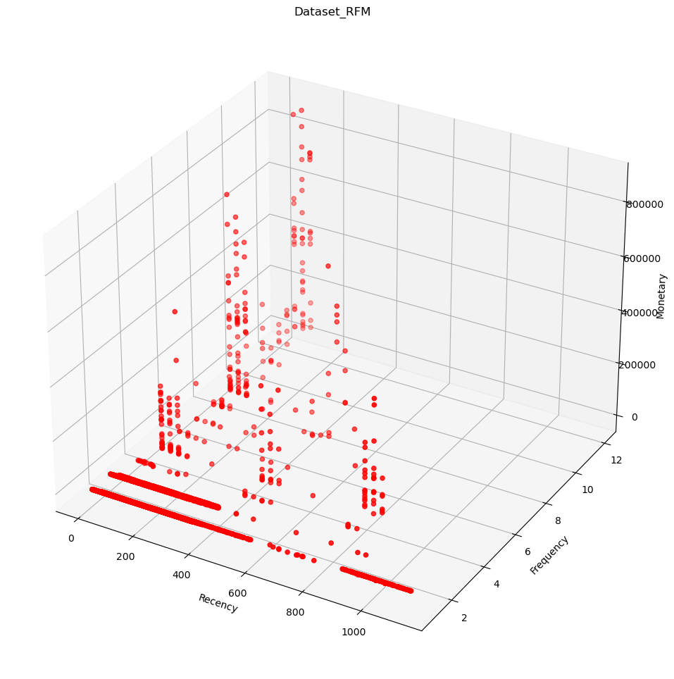
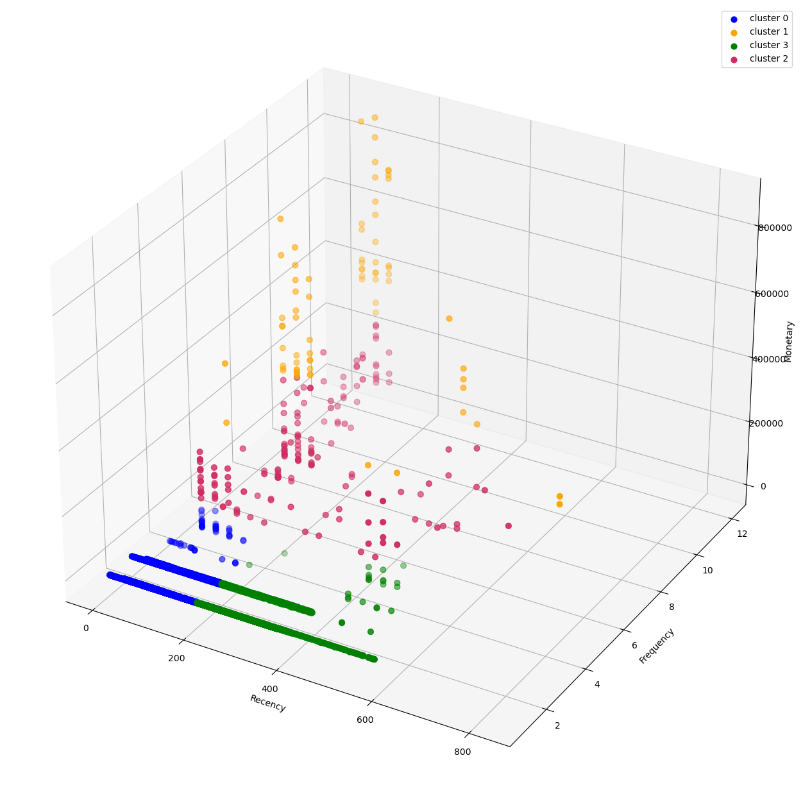
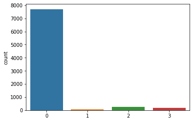
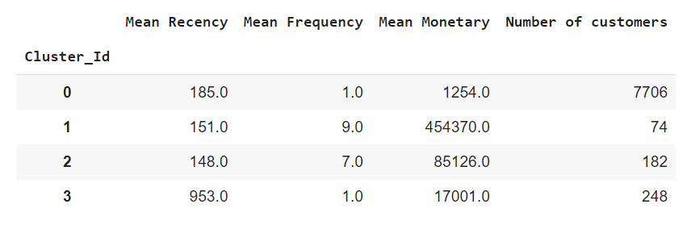

# K-Means-Clustering
Build a customer clustering model based on the RFM model, applying Machine Learning algorithms and data processing techniques.
## AdventureWorks Database sample

This project focuses on data analysis based on the Adventure Works sample database. Adventure Works Cycles, a fictional bicycle manufacturer, provides a rich dataset supporting various business scenarios including manufacturing, sales, purchasing, product management, contact management, and human resources. Adventure Works Cycles operates internationally with three main regional sales offices in America, Europe, and the Pacific.


## I. Extract and Process Data To Dataframe based on RFM model

In this phase of the project, I utilized the `Sales.SalesOrderHeader` table to extract and process data for the United States (US) market. The table contains essential fields such as `SalesOrderID`, `OrderDate`, `CustomerID`, `SubTotal`, and `TerritoryID`. By filtering records for the US market, consisting of 12,041 order records, we computed RFM (Recency, Frequency, Monetary) values for each customer.

### SQL Queries Used:

#### Frequency, Recency, Monetary Calculation
```sql
CREATE OR ALTER VIEW RFM_US AS 
SELECT 
    CustomerID, 
    DATEDIFF(DAY, MAX(OrderDate), (SELECT MAX(OrderDate) FROM Sales.SalesOrderHeader)) + 1 AS 'Recency', 
    COUNT(SalesOrderNumber) AS 'Frequency', 
    SUM(SubTotal) AS 'Monetary' 
FROM 
    Sales.SalesOrderHeader 
WHERE 
    TerritoryID BETWEEN 1 AND 5 
GROUP BY 
    CustomerID;
```
#### Invoice Dataframe for analyst
```sql
CREATE OR ALTER VIEW INVOICE_DATASET AS 
SELECT 
    H.CustomerID, 
    H.SalesOrderNumber, 
    H.OrderDate, 
    D.OrderQty, 
    D.UnitPrice, 
    D.ProductID 
FROM 
    Sales.SalesOrderHeader H 
JOIN 
    Sales.SalesOrderDetail D ON H.SalesOrderID = D.SalesOrderID 
WHERE 
    H.TerritoryID BETWEEN 1 AND 5;
```
## II. Clustering Customer using K-means Algorithms

In this phase, we employed the K-means clustering algorithm to segment customers based on their characteristics. After preprocessing the data, we built a machine learning model using K-means, resulting in distinct customer clusters.

### Dataset Analysis:

#### Original Dataset:


#### Clustered Dataset:


#### Cluster Statistics:


#### Characteristics of Each Cluster:

